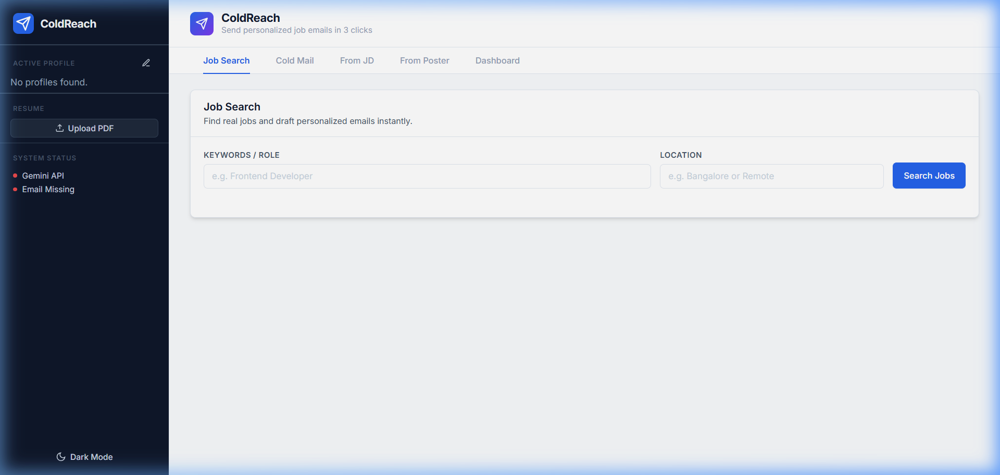

# ColdReach

**ColdReach** is an AI-powered, multi-profile cold emailing and job application tracking platform. It leverages Google's Gemini Vision and LLM models to instantly parse job descriptions, LinkedIn flyers, and cold outreach targets, mapping them directly to your uploaded resume to generate highly personalized, human-sounding emails.

Built with a sleek, Linear-inspired SaaS aesthetic, it prioritizes speed, intelligent context matching, and an uninterrupted flow so you can focus on finding the right opportunities, not writing repetitive cover letters.



## Core Features

- **Resume-Driven Intelligence:** Upload your PDF resume once. Gemini extracts your skills and experiences and intelligently maps them to the Job Descriptions you paste or the flyers you upload.
- **Vision-Powered Poster Parsing:** Upload a screenshot of a job posting or a flyer, and ColdReach will extract the role, company, and HR email automatically.
- **Tone & Style Control:** Choose how you want to sound—professional, enthusiastic, casual, or bold.
- **Contextual Resends:** Didn't get a reply? Hit "Resend with new angle", type in a new focus (e.g., "Emphasize my Python skills"), and the AI will completely restructure the email to highlight the new angle.
- **Multi-Profile Support:** Manage multiple roles (e.g., Frontend Developer vs. UX Designer). Swap profiles instantly to adapt your emails to the persona you want to project.
- **Smart Follow-ups:** Automatically tracks how many days have passed since you applied, giving you one-click intelligent follow-ups at 3, 7, and 14 days.
- **Kanban Tracker:** Track your drafts, sent emails, replies, and interviews on a beautiful drag-and-drop-style dashboard.

---

## 📖 How to Use ColdReach (User Guide)

ColdReach is designed to act as your personal AI recruiter and application manager. Follow these steps to supercharge your job hunt.

### Step 1: Initial Setup
Before generating your first email, you need to configure your identity.
1. Click the **Profile Icon** (bottom left of the sidebar) to open the Profile Manager.
2. Create your active profile by entering your Name, GitHub, Portfolio, and LinkedIn URLs. *You can create multiple profiles if you apply for different roles (e.g., one for "Data Engineer", one for "Full Stack Developer").*
3. Go to the **Settings Tab**.
4. **Upload your Resume (PDF)**. This is a crucial step! The AI reads your resume to ensure it NEVER hallucinates skills and perfectly tailors every email to your actual experience.

### Step 2: Draft an Application
You have three different ways to generate highly personalized outreach emails:

- **Option A (Cold Mail):** Use this when reaching out to recruiters, founders, or HR without a specific job posting. Just enter their email and the company name, select a Tone, and the AI will draft a compelling introduction.
- **Option B (From JD):** Found a great job description on LinkedIn or Indeed? Copy-paste it into this tab. The AI will cross-reference the JD's requirements with your uploaded resume and highlight the exact 2-3 skills that make you the perfect fit.
- **Option C (From Poster):** See an image flyer or screenshot of a hiring post on social media? Upload the image directly. Gemini Vision will read the image, extract the recruiter's email, the job title, and the company, and automatically draft the application.

> **💡 Pro-Tip:** Use the **Tone / Style** dropdown to match the company culture. Applying to a bank? Choose *Professional and direct*. Applying to a trendy startup? Choose *Enthusiastic and passionate*.

### Step 3: Manage the Lifecycle in the Dashboard
Once an email is drafted, it moves to your **Dashboard**. 

1. **Review & Send:** Your new drafts start in the "Draft" column. Click the "Send Email" icon. If your `.env` is configured correctly with a Gmail App Password, the email will be sent instantly and automatically move to the "Applied" column!
2. **Follow-ups:** The dashboard tracks the age of your applications. If days pass without a reply, a badge will appear urging you to follow up. Click the **Follow-up** button, and the AI will instantly generate a polite, 2-sentence follow-up email.
3. **Resend with a New Angle:** Want to try again but take a different approach? Click the **Rewrite** button and give the AI a prompt like: *"They didn't reply, write a new email emphasizing my recent Docker deployment."* The AI will rewrite the outreach email based on your new angle.
4. **Drag and Drop:** As you get interviews or rejections, simply drag and drop the application cards across the Kanban board to stay organized.

---

## 🛠️ Getting Started (Installation)

### Prerequisites
- Node.js (v18+)
- Python 3.10+
- A Google Gemini API Key
- A Gmail account with an **App Password** (for sending emails).

### 1. Clone & Setup
```bash
git clone https://github.com/just000Curious/ColdReach-.git
cd ColdReach-
```

### 2. Configure Environment
Copy the example environment file and fill in your secrets.
```bash
cp .env.example .env
```
Inside `.env`, you must provide:
- `GEMINI_API_KEY`: Your Gemini API Key from Google AI Studio.
- `EMAIL_SENDER_ADDRESS`: The Gmail address sending the emails.
- `EMAIL_APP_PASSWORD`: The 16-character App Password (not your main password).

*(Optional)* You can also add Adzuna credentials for the integrated Job Search tool.

### 3. Start the Backend
The backend uses FastAPI and Uvicorn.
```bash
pip install -r requirements.txt
python -m uvicorn server:app --reload --port 8000
```

### 4. Start the Frontend
The frontend uses Vite and React.
```bash
cd frontend
npm install
npm run dev
```

Visit `http://localhost:5173/` and navigate to the **Settings** tab to verify your System Health.

## Security
ColdReach is designed to run locally. Your API keys, App Passwords, and personal job search data (like your database and token usage) never leave your machine. They are never exposed to the frontend UI or sent to any external server (other than the official Google Gemini endpoints).

## License
MIT License
