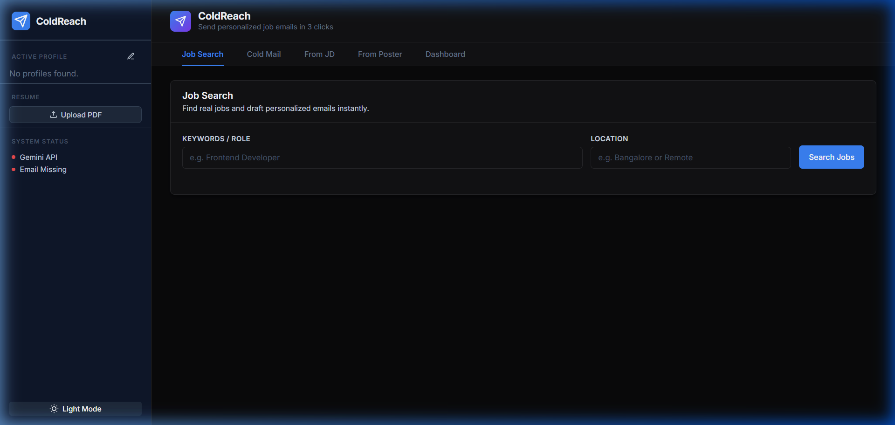
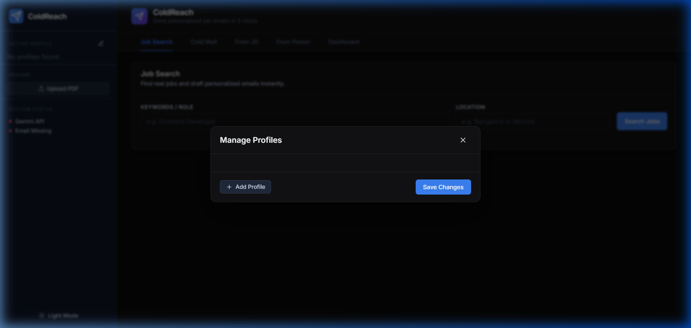

# ColdReach

**ColdReach** is an AI-powered, multi-profile cold emailing and job application tracking platform. It leverages Google's Gemini Vision and LLM models to instantly parse job descriptions, LinkedIn flyers, and cold outreach targets, mapping them directly to your uploaded resume to generate highly personalized, human-sounding emails.

Built with a sleek, Linear-inspired SaaS aesthetic, it prioritizes speed, intelligent context matching, and an uninterrupted flow so you can focus on finding the right opportunities, not writing repetitive cover letters.


## Features

- **Resume-Driven Intelligence:** Upload your PDF resume once. Gemini extracts your skills and experiences and intelligently maps them to the Job Descriptions you paste or the flyers you upload.
- **Vision-Powered Poster Parsing:** Upload a screenshot of a job posting or a flyer, and ColdReach will extract the role, company, and HR email automatically.
- **Contextual Resends:** Didn't get a reply? Hit "Resend with new angle", type in a new focus (e.g., "Emphasize my Python skills"), and the AI will completely restructure the email to highlight the new angle.
- **Multi-Profile Support:** Manage multiple roles (e.g., Frontend Developer vs. UX Designer). Swap profiles instantly to adapt your emails to the persona you want to project.
- **Smart Follow-ups:** Automatically tracks how many days have passed since you applied, giving you one-click intelligent follow-ups at 3, 7, and 14 days.
- **Kanban Tracker:** Track your drafts, sent emails, replies, and interviews on a beautiful drag-and-drop-style dashboard.

---

### Dark Mode & Themes
Beautifully designed light and dark modes tailored with harmonious UI tokens.


### Profile Manager
Tailor your application persona by setting up distinct profiles with unique portfolios and GitHub links.


---

## Getting Started

### Prerequisites
- Node.js (v18+)
- Python 3.10+
- A Google Gemini API Key
- A Gmail account with an **App Password** (for sending emails).

### 1. Clone & Setup
```bash
git clone https://github.com/just000Curious/ColdReach-.git
cd ColdReach-
```

### 2. Configure Environment
Copy the example environment file and fill in your secrets.
```bash
cp .env.example .env
```
Inside `.env`, you must provide:
- `GEMINI_API_KEY`: Your Gemini API Key from Google AI Studio.
- `EMAIL_SENDER_ADDRESS`: The Gmail address sending the emails.
- `EMAIL_APP_PASSWORD`: The 16-character App Password (not your main password).

*(Optional)* You can also add Adzuna credentials for the integrated Job Search tool.

### 3. Start the Backend
The backend uses FastAPI and Uvicorn.
```bash
pip install -r requirements.txt
python -m uvicorn server:app --reload --port 8000
```

### 4. Start the Frontend
The frontend uses Vite and React.
```bash
cd frontend
npm install
npm run dev
```

Visit `http://localhost:5173/` and navigate to the **Settings** tab to upload your resume PDF and verify your System Health.

## Security
ColdReach is designed to run locally. Your API keys and App Passwords never leave your `.env` file, and they are never exposed to the frontend UI or sent to any external server (other than the official Google Gemini endpoints).

## License
MIT License
